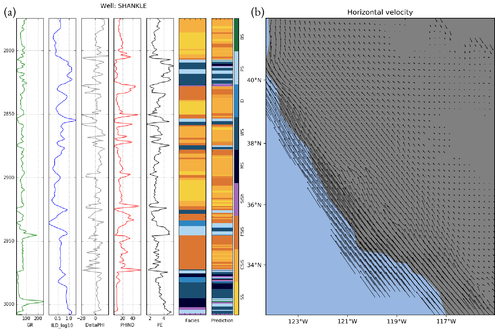

# Machine Learning Lessons for Geophysics

[Leonardo Uieda](http://leouieda.com/)

TGIF Seminar given at the
[Department of Earth Sciences](http://www.soest.hawaii.edu/GG/index.html)
of the University of Hawaii at Manoa
on October 12, 2018.

|    |Info|
|---:|:---|
|Time|3:30 pm - Friday - October 12, 2018|
|Room|723|
|Slides|doi:[10.6084/m9.figshare.7203344](https://doi.org/10.6084/m9.figshare.7203344)|

## Abstract

Machine learning is the new trend sweeping across the Earth Sciences. From the oil and
gas industry to oceanography, these algorithms are being trained to solve previously
unsolvable (or extremely tedious) problems. But what exactly is "machine learning" and
what can be done with it? In this talk, I will present a brief high-level overview of
some of the core concepts and interesting applications of machine learning methods to
geoscience data. I will also explore some of the best practices and techniques that can
be applied to geophysical inversion and interpolation methods, including a new method
for gridding 3-component GPS data.

*Example machine learning applications: (a) predicting facies from well logs (b)
automatically tuned gridding of GPS velocities.*

----

*The facies prediction example (a) by Hall (2016; https://doi.org/10.1190/tle35100906.1)
is licensed Creative Commons Attribution.*

## Notes

The slides were made in Google Docs. Fonts are Roboto Mono, Aldrich, and Barlow from
Google Fonts.

## License

 
This content is licensed under a <a rel="license"
href="http://creativecommons.org/licenses/by/4.0/">Creative Commons Attribution
4.0 International License</a>.
